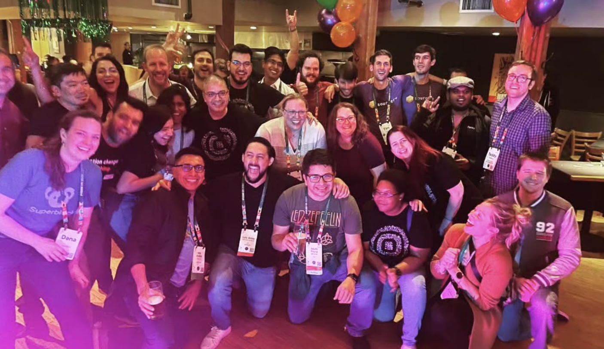
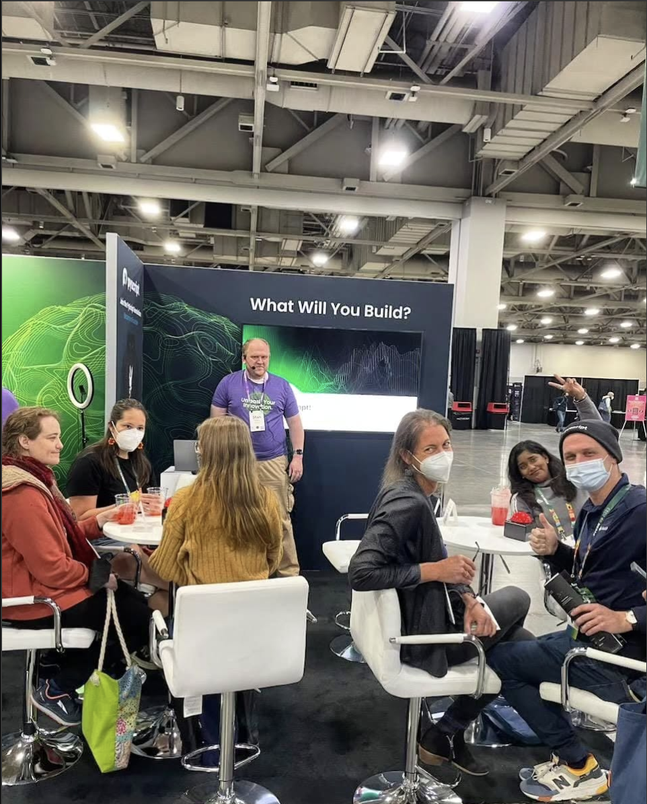
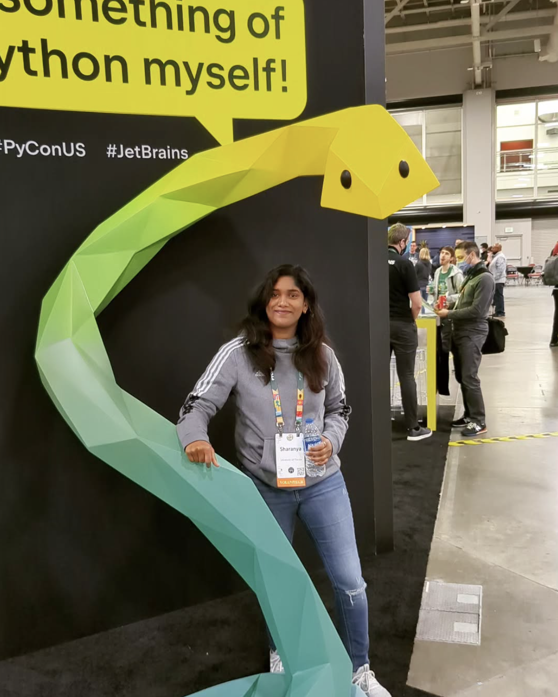

# 👋 Hi, I'm Srisharanya Injarapu!  

🚀 **Software Engineer | Cloud-Native Developer | Intelligent Systems Architect**  

I build **scalable software solutions** that leverage the power of **AI and ML** for enhanced user experiences and operational efficiency. With over 5 years of experience, I specialize in designing and deploying **cloud-native applications**, **microservices architectures**, and **intelligent systems**. My work seamlessly integrates backend development with advanced **ML models**, ensuring robust and efficient applications.  

🎓 **Education**: University of Florida Graduate

---

### 🔥 Key Expertise:  
- **Cloud-Native Application Development**: Architected and deployed microservices using **FastAPI**, **Docker**, and **Kubernetes** for secure and scalable systems.  
- **Backend Engineering**: Implemented RESTful APIs and optimized query performance with **PostgreSQL** and materialized views for high-efficiency data access.  
- **Intelligent Systems Integration**: Incorporated advanced ML models into production systems, leveraging **PyTorch** and **Huggingface**.  
- **DevOps & CI/CD**: Established CI/CD pipelines using **GitHub Actions**, **Terraform**, and **Docker**, enhancing deployment speed and system reliability.  
- **Monitoring & Observability**: Deployed monitoring and alerting solutions using **Prometheus** and **Grafana** to ensure high availability and performance.  

---

### 🤝 Community Engagement:
- 🎤 **Conference Speaker & Attendee**: Active participant at PyCon US and other tech conferences
- 👥 **Tech Community Builder**: Engaging with developer communities and sharing knowledge
- 🌟 **Mentorship**: Contributing to the growth of aspiring developers
  

  

---

### 🔧 Tech Stack:  
- **Programming Languages**: Python, SQL, Bash  
- **Frameworks & Tools**: FastAPI, Docker, Kubernetes, MLflow, DVC  
- **Cloud & DevOps**: Azure, AWS, GitHub Actions, Terraform, Prometheus, Grafana  
- **Database Systems**: PostgreSQL, MongoDB  
- **Machine Learning & AI**: PyTorch, Huggingface, Langchain, OpenAI API

---

### 🚀 Notable Projects:  
- **[Cloud-Native Microservices Platform](#)**: Built REST API-based microservices with **FastAPI**, deployed using **Docker** and **Kubernetes**, enabling secure data access for research applications.  
- **[Inventory Intelligence System](#)**: Developed intelligent inventory tracking using **computer vision** and **dual-camera depth analysis**, deployed on **JetsonOrin** and **RaspberryPi**.  
- **[Data Integration Pipelines](#)**: Designed scalable ETL pipelines for data preprocessing and transformation, optimizing embeddings for NLP applications.  
- **[Predictive Analytics Engine](#)**: Engineered predictive models that identified high-growth products, driving strategic business decisions and operational efficiency.  

---

### 📈 My Impact:  
- Enhanced system scalability and security by designing cloud-native microservices architectures.  
- Reduced deployment time by 30% through efficient CI/CD pipelines and cloud infrastructure automation.  
- Achieved over 97% accuracy in intelligent vision systems, driving impactful business solutions.  

---

### 🌐 Let's Connect:  
- **LinkedIn**: [Srisharanya Injarapu](https://www.linkedin.com/in/srisharanya-injarapu/)  
- **Email**: [injarapusrisharanya@gmail.com]  
Explore my repositories and connect for collaborations in **Cloud-Native Applications**, **Intelligent Systems**, or **Backend Development**!  
